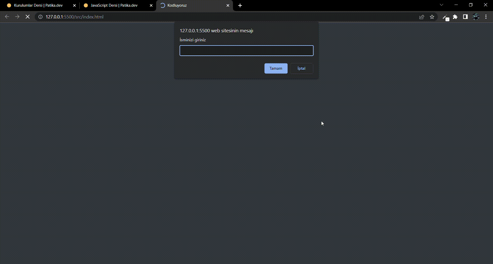

# Ödev 1 - Javascript Saat ve Karşılama

Sizlerden aşağıda gösterdiğimiz gibi bir ekran yapmanızı istiyoruz. Proje dosyalarına erişmek için [buraya](https://drive.google.com/drive/folders/1lghWp2-iPxySOsYxTYoE-mIvvC2waI3g?usp=sharing) tıklayınız.

Basitçe sizden girişte isminizi isteyip sonra bu ismi karşılama ekranına yerleştirerek o anki saati ve günü gösteren bir ekran. Yapması oldukça kolay ve zevkli!

Burada bizim verdiğimiz ile sınırlı kalmak zorunda değilsiniz, hatta hayal gücünüzü çalıştırarak yeni şeyler üretirseniz daha mutlu oluruz!

Hepinize başarılar ve kolay gelsin.

 

# The picture below belongs to my project.

